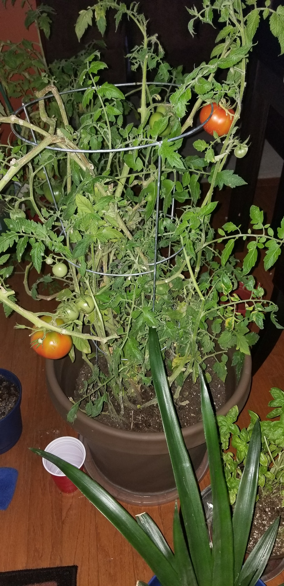
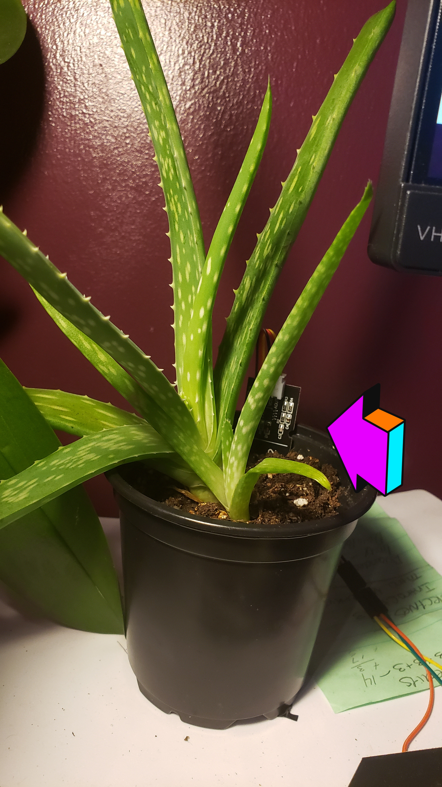

<<<<<<< HEAD
## About
 Smart garden aims to be an effective way monitor and take care of your indoor plants utilizing the Arduino & ESP8266 NODE MCU and the power of the cloud. It monitors soil moisture ,temperature , humidity and how much light your plant gets  (roughly depending). It automatically knows to water your plants based on the amount of moisture detected in the soil, this  can be configured according to the needs of your plant.

 Using Google Cloud IoT Core the ESP8266 is able to connect to the network and publish the telemetry data to a pub sub topic where data will stream into the data. The insights on the plants can be views on the website  Dashboard UI. (Comming soon)

 ## Dependencies
 * [ArduinoJson](https://github.com/bblanchon/ArduinoJson)
 *  [google-cloud-iot-arduino](https://github.com/GoogleCloudPlatform/google-cloud-iot-arduino)

 ## Schematics

 Coming Soon

 
